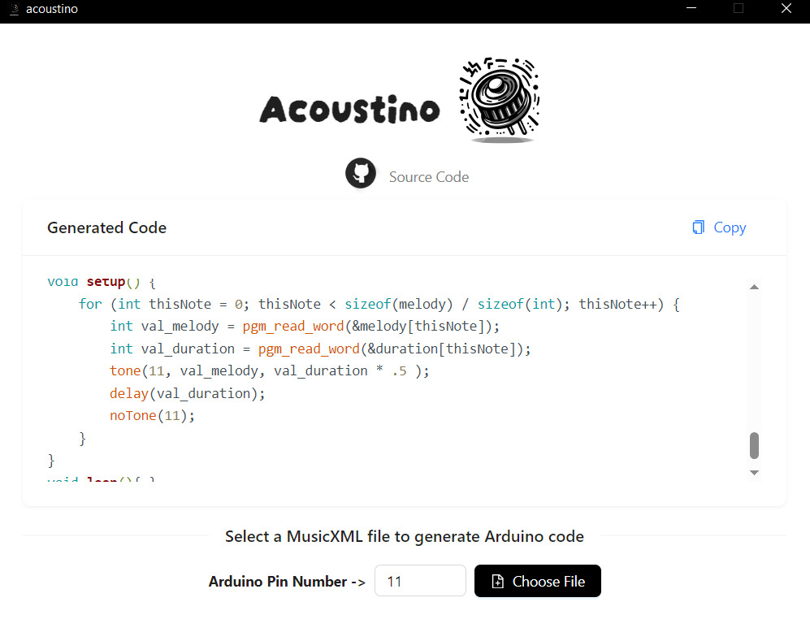

# Acoustino
<p align="center">
<br/>
<a href="https://github.com/actions/toolkit"></a>
<a href="https://github.com/Sreyas-Sreelal/acoustino/pulls"></a>
<a href="https://github.com/Sreyas-Sreelal/acoustino/issues"></a>
<a href="https://github.com/Sreyas-Sreelal/acoustino/blob/master/LICENSE"></a>
<p align="center">
<a href="https://patreon.com/sreyas_sreelal"> </a>
<p align="center">
<a href='https://ko-fi.com/sreyas' target='_blank'>
</p></p>


Acoustino is a simple tool to convert MusicXML to Arduino code, which can play that tone through a piezo buzzer.

# Installation
Download the compiled binaries from release section or build it yourself.

# Building
1. Clone the repository
    ```
    git clone https://github.com/sreyas-sreelal/acoustino.git
    ```

2. Install dependencies
    ```
    cd acoustino
    npm install
    ```

3. Build
    ```
    npm run tauri build
    ```
You can find the compiled binary at `target/release` directory.

# Images



